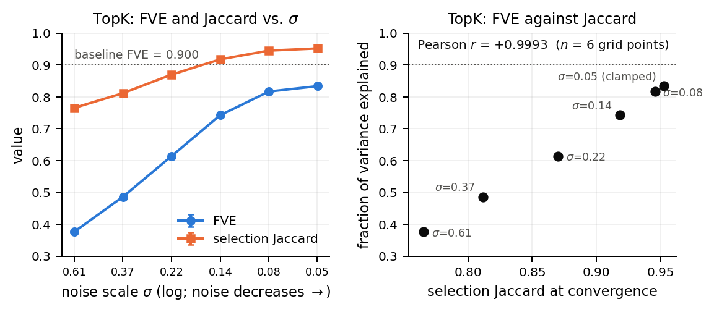

# What a KL term actually does to a TopK sparse autoencoder

A fork of [`dictionary_learning`](https://github.com/saprmarks/dictionary_learning)
extended with variational sparse autoencoders (vSAEs), plus a falsification
framework — e-values and permutation tests over training seeds — built to
decide which claims from the vSAE arXiv preprint survive contact with the
code and the data. Several did not. This repository contains the fixed
trainers, 434 training runs across 45 arms at up to 13 seeds each, the
framework, every number behind the paper, and the paper.

**Paper:** `workshop/mechanism_paper.pdf` (source `workshop/mechanism_paper.tex`).
**Findings in full:** [`docs/RESULTS.md`](docs/RESULTS.md).
**Design:** [`docs/METHODS.md`](docs/METHODS.md).
**What was wrong, and what was retracted:** [`docs/ERRATA.md`](docs/ERRATA.md).
**Recompute every number:** [`docs/REPRODUCE.md`](docs/REPRODUCE.md) — `python reproduce.py --check`, CPU only.

## The claim under test

The preprint added a posterior mean and log-variance to a TopK SAE's
encoder, a KL term to a standard-normal prior, and a reparameterisation
step, and concluded from a Pythia-70M comparison and a β sweep that the KL
term disperses features and improves downstream interpretability. Checking
that against the code and re-running the comparisons at 13 seeds per arm
gave six findings.

## The six findings

**1. The evaluated vSAE was never variational, and two implementations of
the same objective differed by *d* ≈ 16.** With `var_flag = 0` there is no
sampling and the KL reduces to ½‖μ‖²: every checkpoint the preprint
evaluated is a TopK SAE with an L2 activation penalty. Trained against
exactly that null model, the vSAE code still differed by *d* = −5.7 to
+16.5 on reconstruction and up to +13.0 on liveness. The code diff between
the two trainers was enumerated and frozen at fifteen items; matching them
one at a time, each factor traded against the last, and only at the final
rung — with the diff exhausted — were the arms null on every metric, at the
power that had detected every earlier rung at 5σ. None of the five
load-bearing factors appears in either paper's equations.

**2. With sampling on, the damage is the reparameterisation, not the KL.**
No β in {10⁻⁴ … 1} gives a working model (FVE 0.458 → 0.0001 against a
baseline of 0.900). Turning the KL off entirely with sampling still on
recovers 6.4 % of the gap; the other 93.6 % is sampling itself. The learned
σ does not collapse (σ ≈ 0.27), so the deterministic SAE is not the
variational SAE's optimum.

**3. The mechanism is selection churn, and it needs hard-*k* selection.**
The gap between the *k*-th and (*k*+1)-th pre-activation is ~10⁻⁴, far below
any achievable noise scale, so noise flips the selected set. Across a
six-point noise sweep at 13 seeds per point, reconstruction tracks the
Jaccard overlap between two stochastic selections of the same token at
*r* = +0.9993 for TopK and +0.9979 for BatchTopK. For JumpReLU's soft learned
threshold the naive *r* = +0.93 is confounded by an 8× swing in achieved L0;
held roughly fixed, the coupling falls to *r* ≈ +0.5 — and the more basic
finding is that a gradient-learned sparsity level is not itself noise-robust.



**4. One-line implementation details are effects of *d* = 4–19.** A
`F.relu(mu)` that one trainer applies and another does not: *d* = +19.3 /
+15.3 on liveness. A decoder-gradient projection imported and never called:
up to *d* = 14.3 on reconstruction — inside models with an activation
penalty; null in a plain TopK SAE. The decoder's initial scale: *d* = 16.5.
Whether the initial weights were drawn Gaussian or uniform: *d* = 4.7 / 7.3.
None is a hyperparameter anyone reports.

**5. The field's designs cannot see effects of that size.** A two-sided
seed-permutation test with *n* seeds per group cannot express more than
2/C(2n, n): 3.07σ at six seeds, 0σ at one. All ten SAE-methods papers in
the bibliography train one seed per configuration.

**6. On the preprint's own Pythia checkpoints, SCR and TPP disagree.**
Size-matching the baseline to the vSAE's 1,474 live features, SCR says the
vSAE's advantage is not explained by dictionary size (+0.082) and TPP says
it is (−0.085) — same checkpoints, same grid. The disagreement is
threshold-uniform, survives a conditional and a full bootstrap, replicates
across eight dataset/pair points, and is not "masked versus trained small".
It is reported as unresolved: the preprint's own Global and Conclusion
sections reached opposite verdicts on the same hypothesis for the same
reason.

## Reproduce

```bash
pip install numpy scipy matplotlib
python reproduce.py --check          # every table and figure in the paper from committed data; ~45 s
python -m pytest falsification/tests/ -q   # 115 tests, CPU
./workshop/build_paper.sh            # rebuild the PDF (fetches tectonic on first use)
```

`--check` asserts 125 printed numbers against the paper and exits non-zero
on drift. Run metadata for all 434 runs (`config.json`,
`evaluation_results.json`, the per-feature selection counts) is committed
under `experiments/`; the 2.3 GB of weights are not. Training needs a GPU;
`docs/REPRODUCE.md` has the commands and the environment.

## Repository layout

```
reproduce.py             every figure and table in the paper, from committed data
docs/                    RESULTS, METHODS, ERRATA, REPRODUCE; notebook/ is the frozen working record
workshop/                mechanism_paper.{tex,pdf}, references.bib, figs/, build_paper.sh
falsification/           the framework (evalues.py, permutation.py, simulate.py), run_arm.py,
                         the arm readers and E4 scorers, cached *_results.json, tests/
dictionary_learning/     fork of saprmarks/dictionary_learning + the vSAE trainers
  trainers/vsae_topk.py            TopK vSAE (applies F.relu(mu); project_decoder_grad flag)
  trainers/vsae_topk_masked_kl.py  masked-KL variant (relu_mu flag)
  trainers/vsae_batch_topk.py      BatchTopK vSAE (frac_recovered unreliable -- ERRATA)
  trainers/vsae_jump_relu.py       JumpReLU vSAE (three bugs fixed before any run -- ERRATA)
training_scripts/        one script per trainer; run_arm.py drives them
experiments/             one directory per arm, one per seed; metadata committed, weights not
comprehensive_histogram_analysis/  the preprint's original checkpoints' analysis
SAEBench-main/           vendored SAEBench v0.4.2 (modifications listed in ERRATA §5)
```

## Using `falsification/` on your own comparison

```python
from falsification.evalues import FalsificationTest, SequentialFalsifier
from falsification.permutation import seed_permutation_test

f = SequentialFalsifier(main_hypothesis="A yields better features than B", alpha=0.1, kappa=0.3)
res = seed_permutation_test(a_metric_per_seed, b_metric_per_seed, n_perm=4_000_000)
f.add(FalsificationTest(
    name="near-dead fraction, size-matched",
    null_hypothesis="A is no better than B", alt_hypothesis="A is better than B",
    p_value=res["p_value"], unit_of_analysis=res["unit_of_analysis"], n_units=res["n_units"],
    confounders_controlled=("live feature count", "L0"),
))
print(f.report())
```

Two rules do the work: a claim about an *architecture* needs a permutation
test over *training seeds* (token-level tests describe two checkpoints); and
a test whose sub-null is not implied by the main null is excluded from the
evidence, not down-weighted. Read `p_floor` before quoting `p_value`.
`falsification/README.md` has the details.

## Citation

```bibtex
@misc{vsae-falsification-2026,
  title   = {What a KL term actually does to a TopK sparse autoencoder: implementation variance, selection churn, and a falsification framework for SAE claims},
  author  = {Zach},
  year    = {2026},
  note    = {\url{https://github.com/ZachData/SPAR-Variational-Sparse-Autoencoders}},
}
```

Built on `dictionary_learning` (Marks, Karvonen & Mueller, 2024) and SAEBench
(Karvonen et al., 2025). MIT licence, as upstream.
